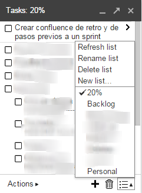

```
Work in progress
```
# Application design

## Features on Gmail tasks
** Tasks lists **

A task list is a container of tasks.

Properties:

* name

Features:

 * CRUD
 * Synchronise




** Tasks **

A task list is a container of tasks.

Properties:

* name

Features:

 * CRUD
 * Synchronise

 * CRUD Tasks
 * Reorder tasks with is sub tasks


## Folder & files structure
<pre>
ToDo
  |- docs
  |   `- Several docs files (*.md or others)
  |- src
  |   |-
  |- test
  |- build
  |- tmp
  `- node_modules
</pre>